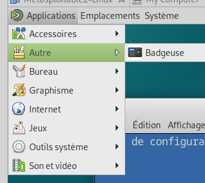
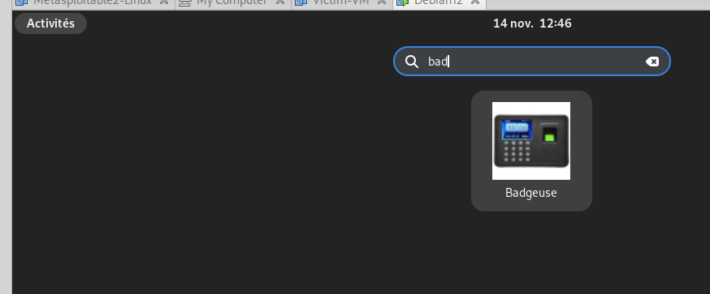

# Patch badgeuse

## Installation
sudo apt install -y git python3-venv python3-pyscard build-essential libpcsclite-dev python3-dev python3-tk  -y

git clone https://github.com/thierry-rami/badgeuse.git

cd badgeuse/

./setup.sh 

# Lancement 

## Terminal
~/Badgeuse_Activity/Badgeuse.sh

## ajout icone bureau mate/Gnome
ajouté dans le script d'installation
## depuis Mate / Gnome

